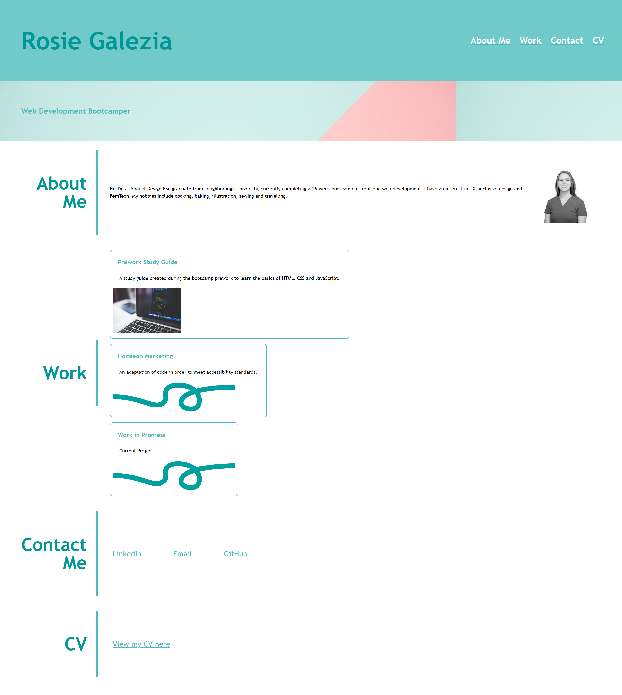

# week-2-portfolio

## Description

This project is a first iteration of a personal portfolio website. It will function as a website to use for future jobs, as well as a way to practice the skills learnt so far in the front-end web development bootcamp.

This was a good opportunity to practice applying CSS grids and flexbox, and learn about responsive design.

## Installation

1. Copy the following link: https://github.com/rosiegalezia/week-2-portfolio.git
2. Open Git Bash
3. Change the current working directory to the desired location for the cloned directory using the cd command
4. Use the command git clone followed by the url https://github.com/rosiegalezia/week-2-portfolio.git and press enter to clone locally

## Usage

The website is available at https://rosiegalezia.github.io/week-2-portfolio/ 

An image of the website's appearance is shown here:

## Credits

N/A

## License

MIT License

Copyright (c) 2023 rosiegalezia

Permission is hereby granted, free of charge, to any person obtaining a copy
of this software and associated documentation files (the "Software"), to deal
in the Software without restriction, including without limitation the rights
to use, copy, modify, merge, publish, distribute, sublicense, and/or sell
copies of the Software, and to permit persons to whom the Software is
furnished to do so, subject to the following conditions:

The above copyright notice and this permission notice shall be included in all
copies or substantial portions of the Software.

THE SOFTWARE IS PROVIDED "AS IS", WITHOUT WARRANTY OF ANY KIND, EXPRESS OR
IMPLIED, INCLUDING BUT NOT LIMITED TO THE WARRANTIES OF MERCHANTABILITY,
FITNESS FOR A PARTICULAR PURPOSE AND NONINFRINGEMENT. IN NO EVENT SHALL THE
AUTHORS OR COPYRIGHT HOLDERS BE LIABLE FOR ANY CLAIM, DAMAGES OR OTHER
LIABILITY, WHETHER IN AN ACTION OF CONTRACT, TORT OR OTHERWISE, ARISING FROM,
OUT OF OR IN CONNECTION WITH THE SOFTWARE OR THE USE OR OTHER DEALINGS IN THE
SOFTWARE.